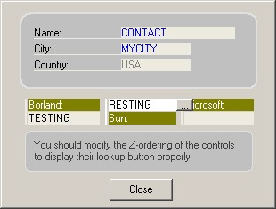



## LabeledTextBox UserControl

### Description

New features: LabelStyle [was:Color properties and font properties.]

I create this user control because I am tired of having to repeatedly put a label control whenever I put a textbox control. Basically, this user control is a combination of a label and a textbox control. However, I have added an optional lookup button at the right side of the control so you can use it as a lookup button.

Other features include auto highlight of text inside the textbox, make ENTER key in textbox behave like pressing TAB key (ie. move focus to next control), and set keyboard shortcut to click the lookup button.

Please let me know if there are any bugs.
 
### More Info
 
This code is free for your commercial and non-commercial use as long as you acknowledge and mention my name as the copyright owner of this code at some place visible to the user of your software.

             |
---                |---
**Submitted On**   |2003-09-26 15:48:12
**By**             |[Adhimas Setianegara](https://github.com/Planet-Source-Code/PSCIndex/blob/master/ByAuthor/adhimas-setianegara.md)
**Level**          |Intermediate
**User Rating**    |5.0 (20 globes from 4 users)
**Compatibility**  |VB 6\.0
**Category**       |[Custom Controls/ Forms/  Menus](https://github.com/Planet-Source-Code/PSCIndex/blob/master/ByCategory/custom-controls-forms-menus__1-4.md)
**World**          |[Visual Basic](https://github.com/Planet-Source-Code/PSCIndex/blob/master/ByWorld/visual-basic.md)
**Archive File**   |[LabeledTex1650219262003\.zip](https://github.com/Planet-Source-Code/adhimas-setianegara-labeledtextbox-usercontrol__1-48716/archive/master.zip)

